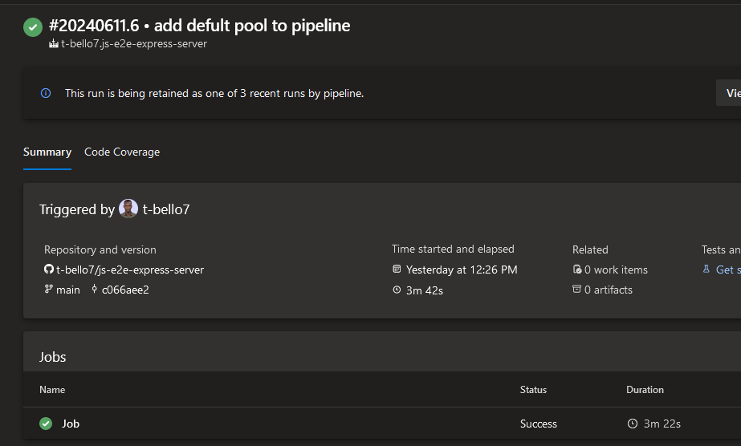

# Azure Pipeline Deployment

In this task we would be making use of Azure DevOps tools and technology to automate the process of deploying a container to Azure App Container Service 

## Walkthrough of dploying a nodejs server Using Pipelins to azure app container service 

1. Sign into your [Azure Devops](https://dev.azure.com) account

2. Create an Organization on Azure DevOps and Create a new project we would be working on. I already have an `az-mentorship` project created.
    

3. Click on the project you would be working on. Your dashboard should look like the image below
    

4. Get your Nodes Js Server. I would be making use of this [repository](https://github.com/t-bello7/js-e2e-express-server)

5. Test your Node Js Server locally to see how it works. This is how my server looks below after running it locally
    

6. Create a docker file to build the docker image of your project. You can use this [article](https://docs.docker.com/language/nodejs/containerize/) to learn how to create a docker image

7. Test the image locally and Push the changes to your github repo

8. Now we are going to use Azure Pipeline to automate the process of dockerizing the container and pushing to ACR. After pushing to ACR we deploy the image to Azure container service

9. Go your azure devops project and create a new pipeline connecting it to the node js github repo

10. When I ran my pipeline I ran into the issue below
    

11. Turns out Microsoft has temporarily disabled the free grant of parallel jobs for public projects and for certain private projects in new organizations. There is a [form](https://aka.ms/azpipelines-parallelism-request) to request for the free grant but it takes 2-3 working days and I want to get the deployment out today. So we would run the pipeline on our local machine instead

12. Follow this [article](https://learn.microsoft.com/en-us/azure/devops/pipelines/agents/windows-agent?view=azure-devops) to create a self hosted pipeline agent on your local machine. I'm using a windows machine so I would be creating a self-hosted windows agent

13. Be sure to update your azurepipelines.yml to use the agent pool name

14. I have the pipeline running successfully 
    

15. Next is to create a service connection to connect the pipeline to azure portal. A service connection is a configuration service that create and stores the connection to external services in Azure DevOps.

16. Go to project settings in azure devOPs. The azure devops has two major setting based on the heirachy - organization settings and project setting. 

18. In project settings, click on service connections tab and create a new service connection
 I created an azure classic service connection
    

19.

